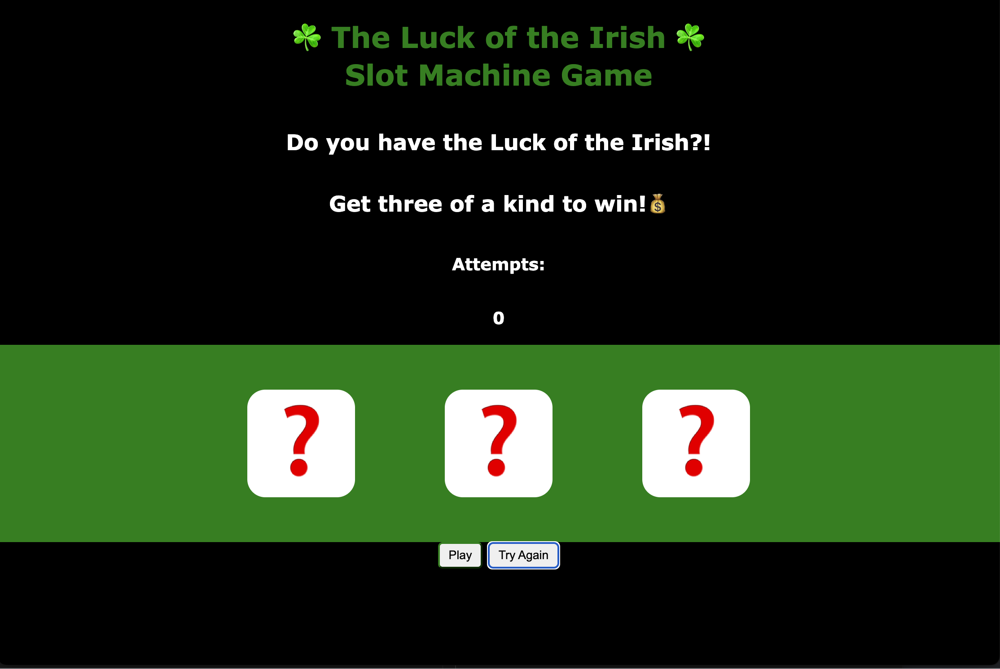
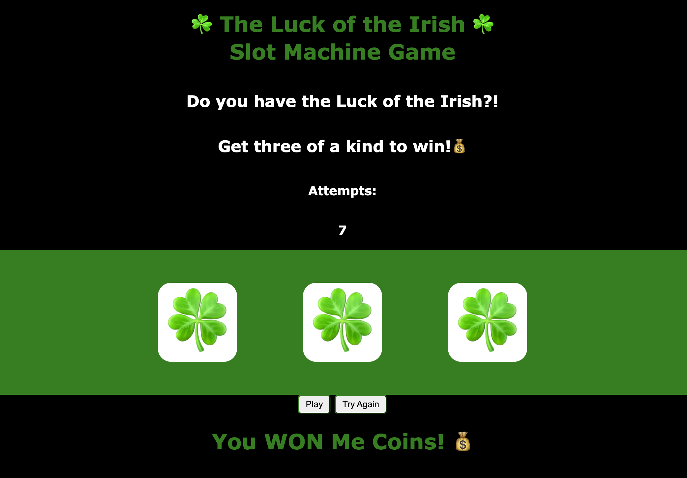
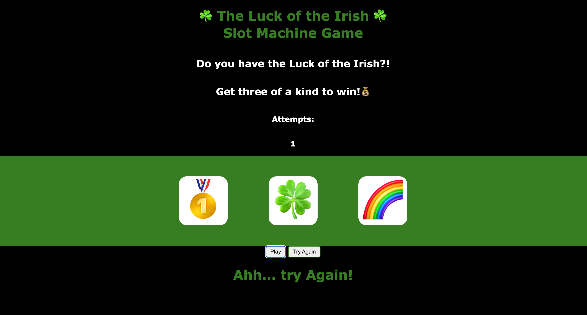

# Sophia Barber - Slot Machine

## ☘️ Game Name: 
- - -
The Luck of the Irish - Slot Machine Game

- - -
## ☘️ Game Description:
- - -
A slot machine is a gambling game that is often times found in casinos. It is a game that starts off with three "?" and once you hit the "Play" button it will randomly display three images on the machine or screen. The goal is to try and get all three images to match in order to win. If you do not get all three images to match, you lose that round. For this specific slot machine game, it will not operate using money, but instead it will operate using the luck of the Irish to get all of our customers to win. You are welcomed to play as many times as you like, since the game is free now. While you are aiming to win a round, the game will keep track of the amount of attempts you have taken in order to win. Once you win a round, you will press the "Try Again" button to clear the board and it will reset to all "?" images. 

## ☘️ Game Background:
- - -
The slot machine game was invented in 1891 and was introduced in Brooklyn, New York. It was based on poker and became an instant success. It started off as a game made of five drums and 50 face cards. Players would have to put a coin in the slot and pull the lever, then the drums would spin and the players would hope to win. When the game was first discovered, technology could not support an automatic payout so some pkayers would win a ber, cigars or anything the house would offer. 

## ☘️ Screenshots of the Game:
- - -
When you win a round, it will look similar to this image. 

When you lose a round, it will look similar to this image.

## ☘️ Technologies Used:
- - -
Javascript, HTML, CSS

## ☘️ Next Steps for the Future:
- - -
1. Ensure the game uses money to function.
2. Add a spin function so you can visually see the emojis spin. 
